# Tiquettes

Générateur d'étiquettes pour tableaux / armoires électriques.

---


[](https://www.tiquettes.fr)

<a href="https://www.tiquettes.fr/dons.php" style="text-decoration: none; background: black; color: white; padding-inline: 1.5rem; padding-block: 1rem; font-size: 0.9rem; font-weight: 600; margin: 0;">Nous soutenir en faisant un don <span style="color: red; margin-left: 0.5rem; font-size: 1.1rem;">♥</span></a>
<br /><br />

&nbsp;&nbsp;
&nbsp;&nbsp;
&nbsp;&nbsp;
-%3CCOLOR%3E?style=flat&color=fff"><br />

&nbsp;&nbsp;
&nbsp;&nbsp;


### Une question ? Des idées à partager / proposer ?

Venez dans le nouvel **[espace de discussions](https://github.com/pantaflex44/Tiquettes/discussions)** !

### A contrario, vous avez découvert un bug, un défaut de fonctionnement ?

Venez plutôt le déclarer dans **[l'espace dédié](https://github.com/pantaflex44/Tiquettes/issues)** :-)

### Vous êtes plus "réseaux sociaux" ?

Retrouvez **Tiquettes** directement sur **[sa page Facebook](https://www.facebook.com/profile.php?id=61563821616548)** !

### Tester en avant première

Vous pouvez tester Tiquettes en cours de développement avant la sortie officielle de sa nouvelle version en utilisant ce lien: **https://www.tiquettes.fr/dev/** ;-)

---

# Bienvenue dans la documentation de Tiquettes

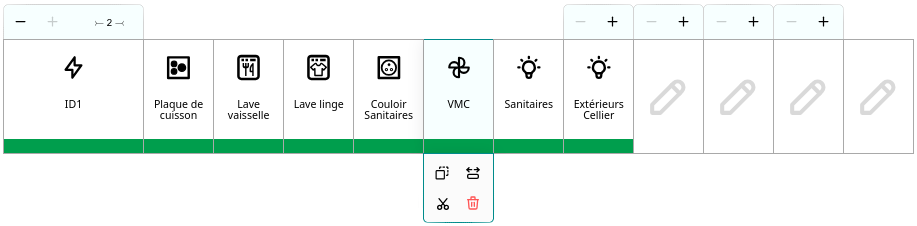

Quoi de mieux que de pouvoir sublimer son tableau électrique, tout en répondant aux besoins de la norme en vigueur ?

Terminées, l'écriture manuscrite, les façades chaotiques et incompréhensibles ! Tiquettes peut vous apporter une solution normalisée et esthétique.


## Sommaire

- [Etiquetter son tableau électrique, plus qu'une affaire de design](#etiquetter-son-tableau-électrique-plus-quune-affaire-de-design)
    - [La sécurité avant tout](#la-sécurité-avant-tout)
    - [Au premier coup d'œil](#au-premier-coup-dœil)
- [Le projet](#le-projet)
    - [Créer un nouveau projet libre](#créer-un-nouveau-projet-libre)
    - [Importer un projet](#importer-un-projet)
    - [Exporter son travail](#exporter-son-travail)
- [L'espace de travail](#lespace-de-travail)
    - [Descriptif](#descriptif)
    - [Résumé du projet](#résumé-du-projet)
    - [Menu contextuel du haut](#menu-contextuel-du-haut)
    - [Menu contextuel du bas](#menu-contextuel-du-bas)
        - [Copier / Couper / Coller](#copier--couper--coller)
        - [Supprimer](#supprimer)
        - [Inter-changer](#inter-changer)
    - [Manipuler les rangées](#manipuler-les-rangées)
- [Édition d'un module](#édition-dun-module)
    - [Les actions disponibles](#les-actions-disponibles)
    - [Les pictogrammes](#les-pictogrammes)
    - [Les groupes](#les-groupes)
- [Décorer ses étiquettes](#décorer-ses-étiquettes)
    - [Personnaliser la décoration](#personnaliser-la-décoration)
    - [Bibliothèque de thèmes](#bibliothèque-de-thèmes)
- [Schéma unifilaire](#schéma-unifilaire)
    - [Édition des caractéristiques](#édition-des-caractéristiques)
        - [L'asservissement](#lasservissement)
        - [Allocation d'un module a ses enfants](#allocation-dun-module-a-ses-enfants)
        - [Les liens de parenté](#les-liens-de-parenté)
    - [Génération du schéma unifilaire](#génération-du-schéma-unifilaire)
        - [Les sources d'alimentations](#les-sources-dalimentations)
- [Moniteur de surveillance](#moniteur-de-surveillance)
- [Nomenclature / Résumé](#nomenclature--résumé)
- [Impression](#impression)
    - [Page de garde](#page-de-garde)
    - [Etiquettes](#etiquettes)
    - [Schéma unifilaire](#schéma-unifilaire)
    - [Nomenclature](#nomenclature)
- [Les étiquetteuses  (en cours de développement)](#les-étiquetteuses)
- [Remerciements ❤ !](#remerciements--)


<div id="etiquetter-son-tableau-électrique-plus-quune-affaire-de-design"></div>

## Etiquetter son tableau électrique, plus qu'une affaire de design

Si la manière d'étiqueter son tableau électrique est laissée libre à chacun, le faire est une obligation reposant sur des critères comme la sécurité et l'information.

<div id="la-sécurité-avant-tout"></div>

### La sécurité avant tout

Le but premier étant de permettre aux utilisateurs de repérer rapidement chaque circuit que compose son installation. En cas d'urgence, il est primordial que vous puissiez couper le circuit en défaut le plus rapidement possible. Vous en conviendrez, un étiquetage clair et illustré remplira parfaitement ce besoin.

La norme NF C 15-100 insiste sur ce point. Cette norme de référence pour l’installation de circuits électriques précise que « chacun des circuits doit être repéré par une indication appropriée, correspondant aux besoins de l’usager et du professionnel. Ce repérage doit préciser les locaux desservis et la fonction ».

En premier lieu, devra être indiqué, la pièce et la fonction correspondante pour chaque circuit.

<div id="au-premier-coup-dœil"></div>

### Au premier coup d'œil

Les étiquettes ne sont que de petits espaces. Il est impossible d'écrire, en détail, tous les éléments de correspondances. N'hésitez pas à utiliser des abréviations claires pour aller à l'essentiel.

Il est de tradition moderne d'accompagner le texte d'un pictogramme simple et rapidement compréhensible. Cette pratique améliore grandement le repérage du circuit recherché.

Pour ajouter de plus amples informations, Tiquettes vous propose la rédaction automatique d'une nomenclature. Chaque module possède un champ « annotations » dans lequel vous pouvez indiquer toute information complémentaire. Ce champ ne sera ajouté qu'à la nomenclature.


<div id="le-projet"></div>

## Le projet

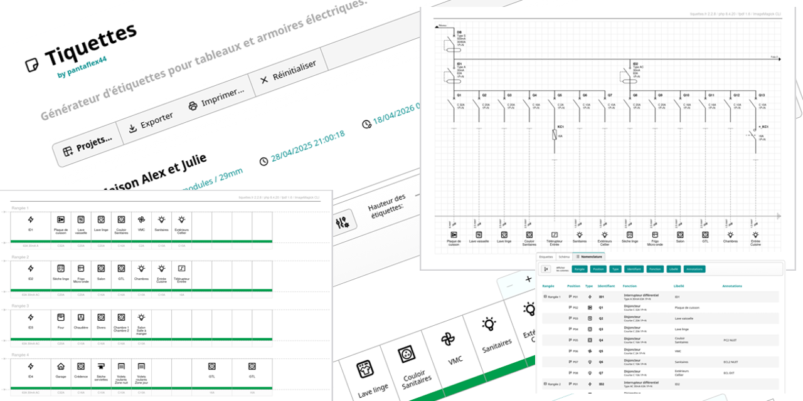

Tout commence par la création de votre projet.<br />
Deux possibilités principales sont à votre disposition:

- Créer un nouveau projet
- Importer un projet existant

Tiquettes.fr est une application web ne proposant pas d'espace de stockage pour conserver ses projets, mais une fonctionnalité d'exportation est disponible pour sauvegarder à votre guise l'ensemble de vos travaux.

Commençons par le menu:

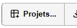

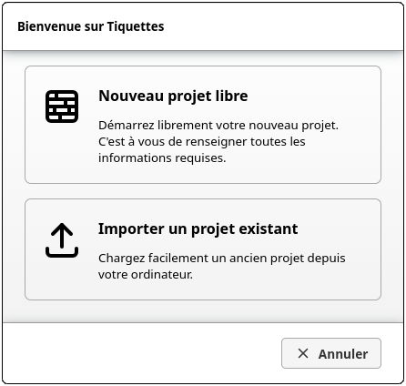

<div id="créer-un-nouveau-projet-libre"></div>

### Créer un nouveau projet libre

Démarrer librement un nouveau projet. C'est à vous de renseigner toutes les informations nécessaires à l'aide de l'assistant.

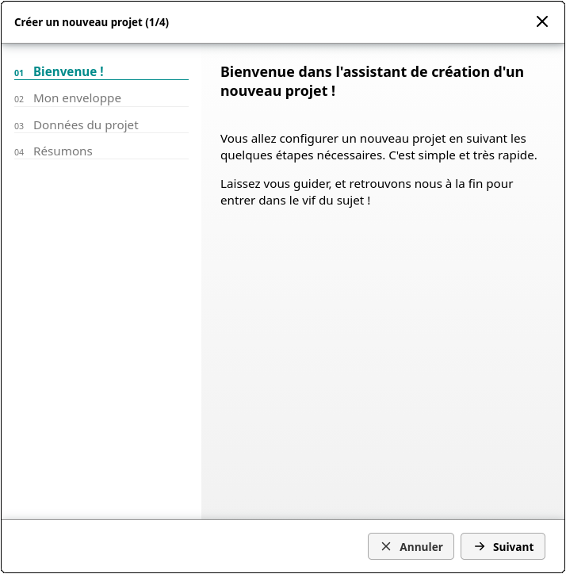
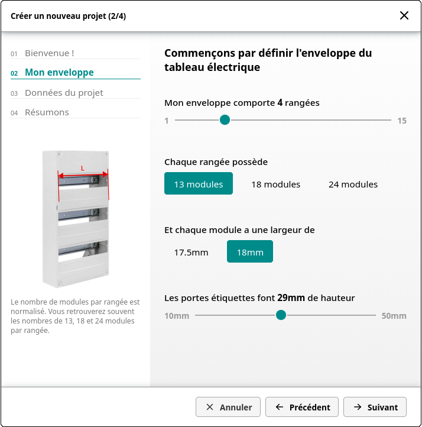

Une enveloppe (carcasse du tableau électrique) comporte plusieurs informations normalisées. Il vous sera demandé de renseigner le nombre de rangées ainsi que le nombre de modules par rangée.

Il vous sera aussi demandé la largeur des modules. Ce paramètre est de nos jours normalisé à 18mm mais certains anciens modules avaient une largeur de 17,5mm. Si votre installation est ancienne et que vous avez un doute sur la largeur des modules, vous pourrez corriger à tout moment cette valeur. L'impression de vos étiquettes vous servira de guide.

La hauteur des étiquettes est aussi un paramètre important. Chaque enveloppe possède un espace dédié pour "fixer" les étiquettes. Mesurez bien la hauteur disponible pour renseigner le paramètre.

>  <b>Bon à savoir</b>
>
> Ne pas hésiter à soustraire 1 mm de la hauteur des étiquettes.
> 
> Les emplacements sont souvent protégés par des plastrons transparents à bascule. Les "charnières" sont épaissent et peuvent masquer le bas des étiquettes !
> 

<div id="importer-un-projet"></div>

### Importer un projet

Tiquettes vous propose d'importer et d'exporter votre travail pour l'archiver ou y retravailler ultérieurement. Une
sauvegarde automatique de votre session de travail est aussi intégrée au système.

Pour importer un projet, cliquez sur le bouton `Importer` puis chargez le fichier correspondant à votre projet.
Immédiatement, celui-ci s'affichera dans la zone de travail!

<div id="exporter-son-travail"></div>

### Exporter son travail

Tel un chef d'oeuvre, il est important ne sauvegarder son travail. Tiquettes.fr vous permet d'exporter l'intégralité du projet dans un fichier JSON.

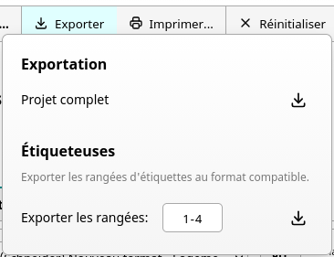

Ce fichier contient l'ensemble de votre travail ainsi que certaines préférences, comme les réglages d'impression, les caractéristiques de votre projet, mais aussi les données personnelles renseignées.

Ce fichier peut être importé à tout moment pour retravailler votre projet.

<div id="lespace-de-travail"></div>

## L'espace de travail

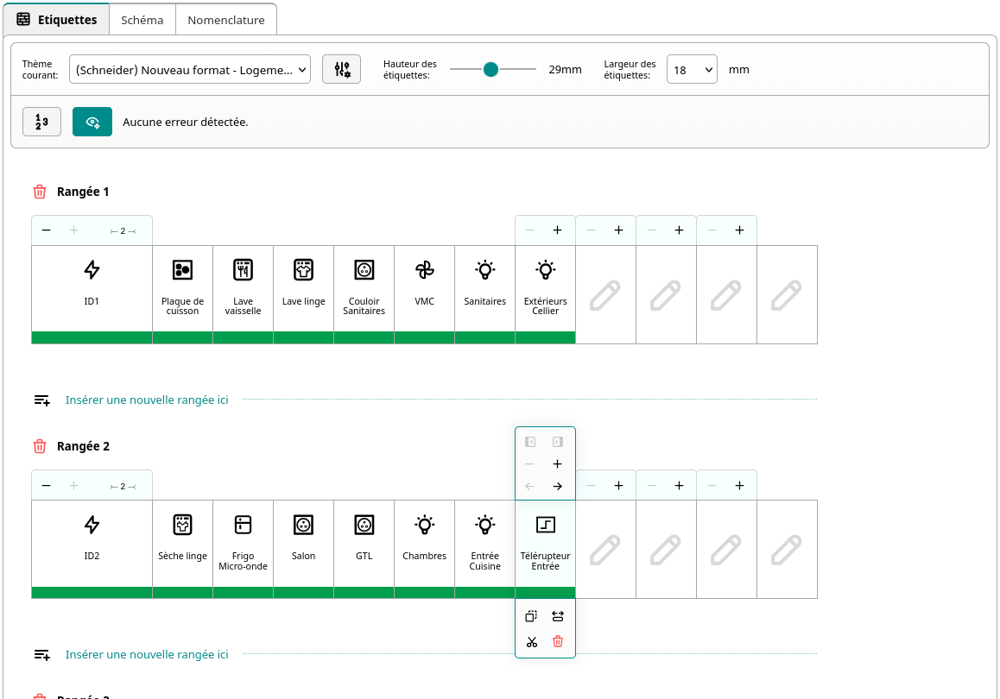

<div id="descriptif"></div>

### Descriptif

Un tableau peut comporter de 1 à 15 rangées, 13, 18 ou 24 modules par rangée.

Chaque module peut avoir une largeur et/ou une position réglable en fonction de la place disponible autour de lui. Vous
pourrez l'étendre jusqu'à rencontrer, soit le bout de la rangée, soit un autre module déjà défini. Vous devrez libérer
celui-ci pour poursuivre son expansion. Idem pour le déplacer, seulement possible dans les espaces libres.

<div id="résumé-du-projet"></div>

### Résumé du projet

Une fois le projet chargé, vous retrouverez un résumé de ses propriétés au-dessus de la zone de travail.


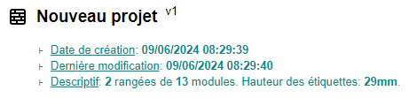

Sous le nom du projet, vous retrouvez le numéro de la dernière version exportée, les caractéristiques de l'enveloppe,
ainsi que dans l'ordre, la date de création et la date de dernière modification.

> <b>🛈 Bon à savoir</b>
>
> Pour modifier le nom du projet, cliquez dessus puis validez les modifications avec la touche `Entrée` de votre
> clavier. A contrario, la touche `Echap` annule les modifications.
>
> 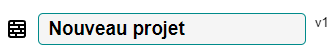

Puis, vous retrouvez les dates de travail ainsi que le descriptif technique.


<div id="menu-contextuel-du-haut"></div>

### Menu contextuel du haut

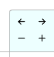

Le symbole `+` vous permet d'agrandir le module d'une largeur sur sa droite.

Le symbole `-` vous permet de réduire le module d'une largeur.

Le symbole `←` vous permet de déplacer le module d'une position sur la gauche.

Le symbole `→` vous permet de déplacer le module d'une position sur la droite.

<div id="menu-contextuel-du-bas"></div>

### Menu contextuel du bas

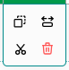

Le symbole `Crayon` (ou la touche `Entrée` du clavier) permet d'éditer le module en question.

<div id="copier--couper--coller"></div>

#### Copier / Couper / Coller

Le symbole suivant permet de copier le module. Cela permet de copier, le libellé, le pictogramme et la description du
module pour le dupliquer ailleurs sur le tableau. Une fois le module mis dans le presse papier, l'application vous met
en avant les emplacements disponibles en fonction de la largeur initiale du module copié.

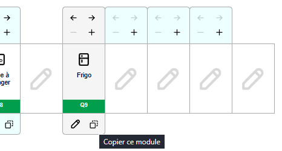

Exemple d'emplacements disponibles :

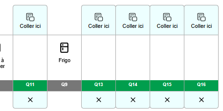

Cliquer sur l'icône pour dupliquer / d&placer le module à cet emplacement.

Pour annuler, soit, cliquer sur l'icône ci-dessous, soit appuyer sur la touche `Echap`:

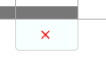

Et voilà!

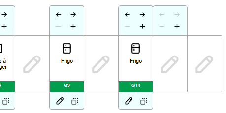

<div id="supprimer"></div>

#### Supprimer

Après confirmation, le module sélectionné sera supprimé!

<div id="inter-changer"></div>

#### Inter-changer

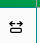

Si vous souhaitez intervertir 2 modules, cette icône est faite pour vous.

Une fois cliquée, choisissez le module compatible pour l'échange. Les modules compatibles sont indiqués en les survolant:

Depuis:

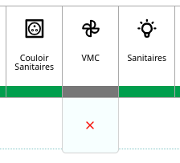

Vers:

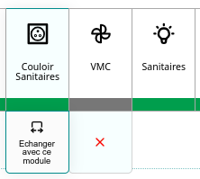

Et voila !

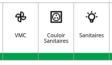


<div id="manipuler-les-rangées"></div>

### Manipuler les rangées

Au cours de l'édition de votre planche d'étiquette, il peut parfois être utile d'insérer et/ou de supprimer une rangée.

Pour insérer une rangée, cliquez sur le raccourci présent entre chacune des rangées existantes:

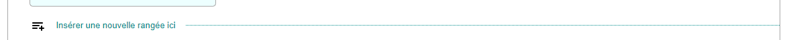

Pour supprimer une rangée, cliquez sur l'icône `Corbeille`, à gauche du nom de la rangée souhaitée:

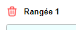

> <b>🛈 Bon à savoir</b>
>
> 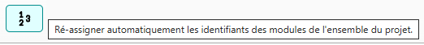
>
> A tout moment, vous pouvez ré-assigner l'ensemble des identifiants votre projet en cliquant sur ce bouton (accessible
> dans l'onglet ```Éditeur``` et ```Schéma```.

Une option est disponible dans l'éditeur de modules permettant d'empêcher ou non le réassignement automatique de l'identifiant d'un module:

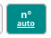

En cliquant sur l'icône correspondante, vous pouvez bloquer l'identifiant actuel:

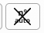

> <b>🛈 Bon à savoir</b>
>
> Pour s'adapter au mieux à la résolution de vos écrans, l'application possède une zone de travail fixe et définie pour une enveloppe de 13 modules. Toutefois, si vous possédez un écran plus grand ou si vous travaillez avec une plus grande résolution, Tiquettes.fr vous propose d'adapter la zone de travaille automatiquement en fonction du nombre de modules par rangée.
>
> <small>**Taille de la zone de travail par défaut**</small><br />
>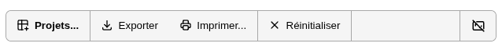
>
> <small>**Taille de la zone de travail avec redimensionnement automatique**</small><br />
>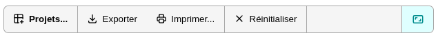

<div id="édition-dun-module"></div>

## Édition d'un module

Après avoir cliqué sur le symbole d'édition d'un module, une fenêtre popup s'ouvre et vous offre la possibilité d'
affiner sa définition.

La partie inférieure de la fenêtre d'édition comporte une zone de démonstration, mettant en scène vos modifications en
temps réel.

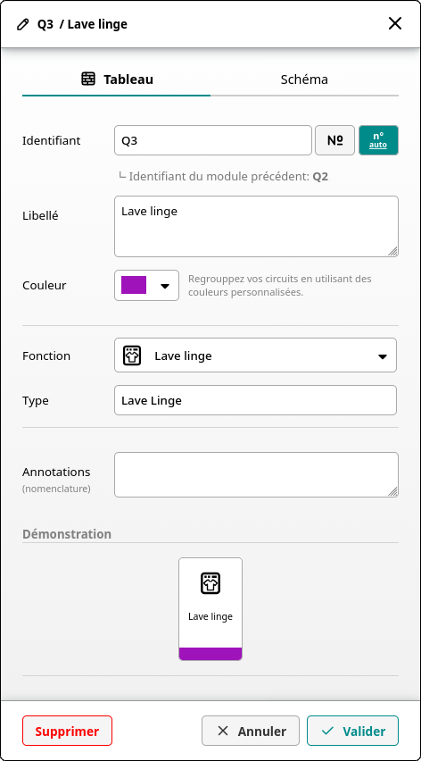

- _Identifiant_ : Identifiant technique du module. Seules les lettres, chiffres et le caractère point sont acceptés.
- _Libellé_ : Une très courte description du module. Les retours à la ligne sont pris en compte.
- _Pictogramme_ : Une petite image illustrant l'environnement du module.

> <b>🛈 Bon à savoir</b>
>
> 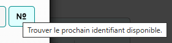
>
> Il est parfois difficile de suivre les identifiants déjà utilisés par les précédents modules, c'est pourquoi un bouton
> est à votre disposition pour trouver automatiquement le dernier identifiant libre correspondant à la fonction du module
> définie dans l'onglet ```Schéma```.

<div id="les-actions-disponibles"></div>

### Les actions disponibles

- **Supprimer**: Permet de libérer un module. Supprime toutes les données liées à ce module.
- **Annuler**: Annule les modifications en cours
- **Valider**: Accepter et appliquer les modifications en cours

<div id="les-pictogrammes"></div>

### Les pictogrammes

Une liste de pictogrammes vous est proposée.

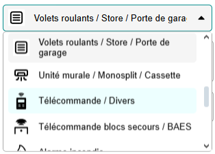

Par ailleurs, vous pouvez aussi rechercher un picto, directement en écrivant une partie de sa description. La liste se
mettra automatiquement à jour.

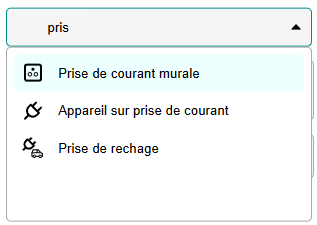

<div id="les-groupes"></div>

### Les groupes

Il est parfois plus simple de regrouper les modules par pièces ou par zones par exemple. Pour ce faire, l'application vous propose de définir une couleur de groupe.

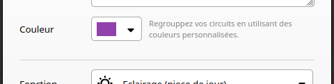

Cette couleur pourra être affichée sur les étiquettes en fonction de la définition du thème sélectionné. Bien évidement, vous pouvez ajuster cet affichage en modifiant les paramètres du thème en cours ou créer votre propre thème !

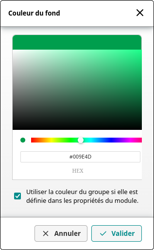

<div id="décorer-ses-étiquettes"></div>

## Décorer ses étiquettes

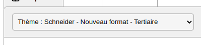

A chacun son style, à chaque coffret sa marque, quoi de mieux que de pouvoir décorer ses étiquettes au style de la
marque du matériel installé?

Sélectionnez le thème de votre choix puis admirez le style de vos étiquettes changez en temps réel!

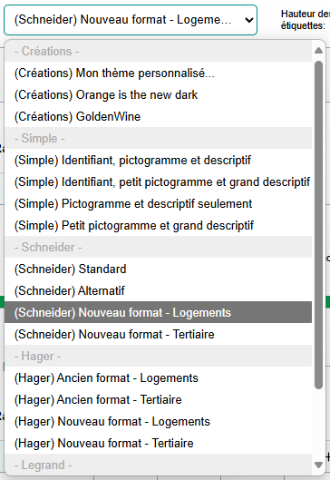

- Thème Simple

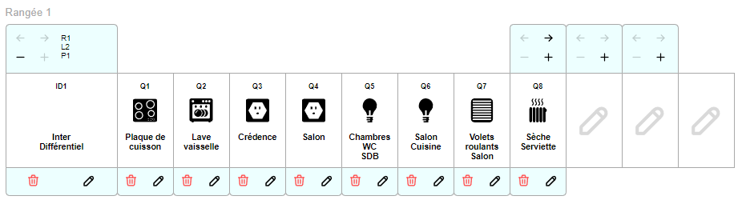

- Thème Minimal

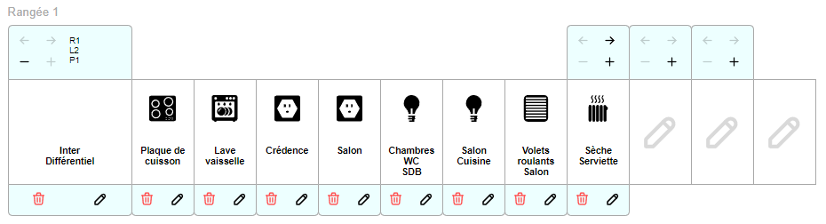

- Thème Schneider - Standard

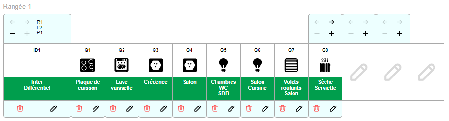

- Thème Schneider - Alternatif

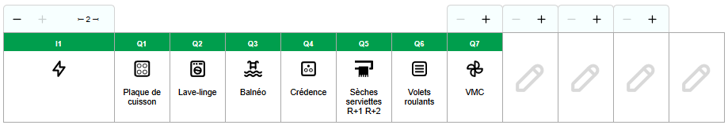

- Thème Schneider - Nouveau format - Logements

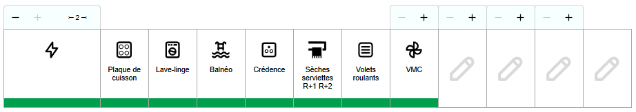

- Thème Schneider - Nouveau format - Tertiaire

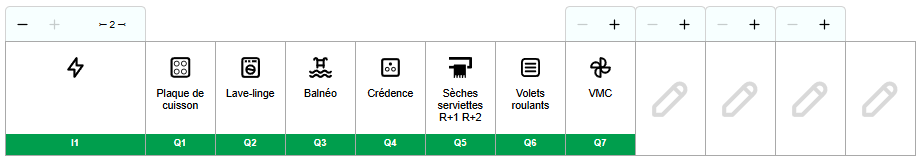

- Thème Hager - Ancien format - Logements

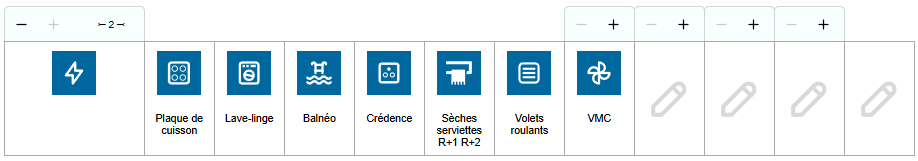

- Thème Hager - Ancien format - Tertiaire

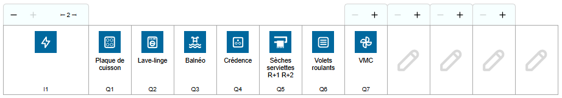

- Thème Hager - Nouveau format - Logements

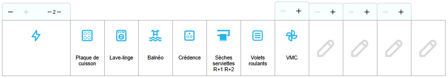

- Thème Hager - Nouveau format - Tertiaire

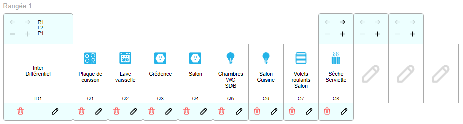

- Thème Legrand - Monochrome - Logements

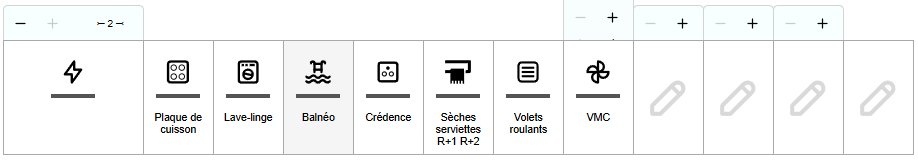

- Thème Legrand - Monochrome - Tertiaire

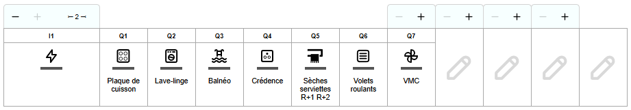

- Thème Legrand - Couleur - Logements

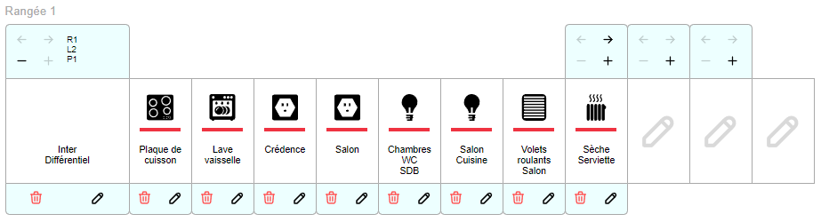

- Thème Legrand - Couleur - Tertiaire

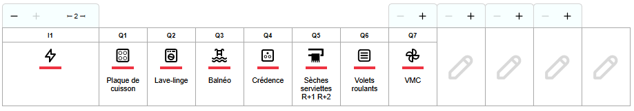

<div id="personnaliser-la-décoration"></div>

### Personnaliser la décoration

Tiquettes vous propose de décorer plus finement vos étiquettes en créant votre propre thème!

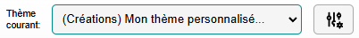

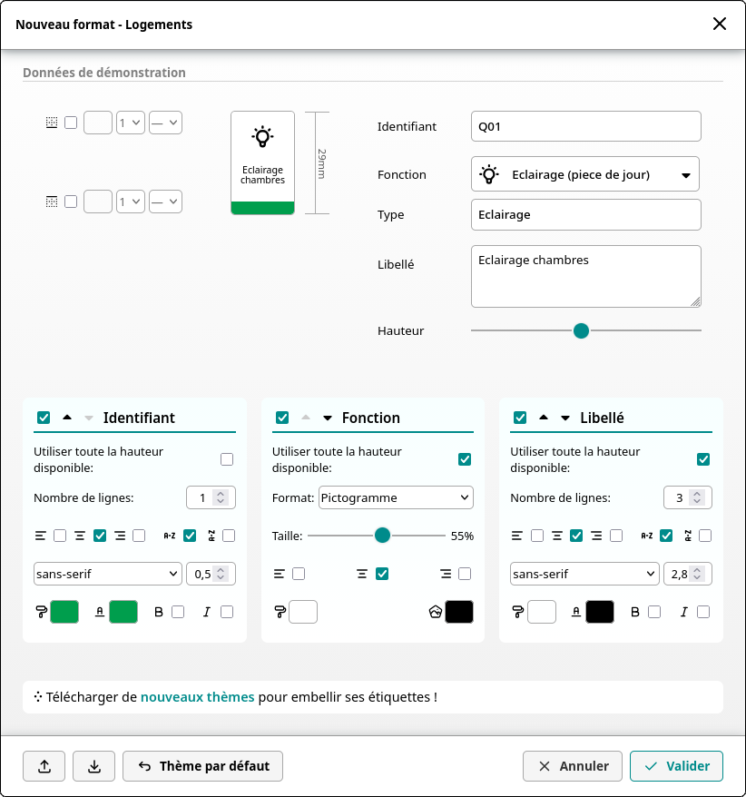

Vous pouvez exporter vos thèmes, et même importer les créations d'autrui !

<div id="bibliothèque-de-thèmes"></div>

### Bibliothèque de thèmes

Tiquettes.fr propose une bibliothèque de thèmes que vous pouvez importer pour personnaliser vos étiquettes. Rendez-vous
à la [bibliothèque](https://www.tiquettes.fr/themes.php) pour découvrir et télécharger les créations artistiques proposées ;-)

<div id="schéma-unifilaire"></div>

## Schéma unifilaire

<div id="édition-des-caractéristiques"></div>

### Édition des caractéristiques

Depuis la version 2.0.0, Tiquettes propose la génération semi-automatique d'un schéma unifilaire représentatif du
tableau électrique conçu par vos soins.

La fenêtre d’édition d'un module possède désormais un nouvel onglet ```Schéma``` permettant de définir les
caractéristiques techniques du module:

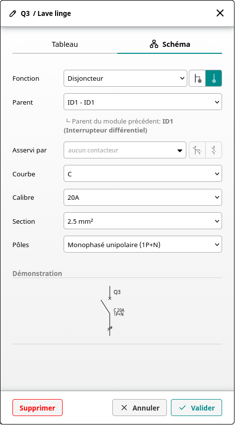

- _Fonction_ : Fonction technique du module : Interrupteur différentiel, Disjoncteur, etc.
- _Parent_ : Module parent dont dépend le module en cours d'édition. Par exemple, ce disjoncteur dépend d'un module
  Interrupteur différentiel.

Les autres informations sont dynamiquement adaptées à la fonction choisie précédemment.

La zone de démonstration affiche la représentation graphique (Symbole) et les caractéristiques techniques telles
qu'elles seront incluses dans le schéma unifilaire global.

<div id="lasservissement"></div>

#### L'asservissement

Les propriétés d'un module propose de définir par quel contacteur un module peut être asservi.

Prenons un exemple concret:

Je souhaite alimenter une ampoule qui devra être commandée par un télérupteur. Donc nous allons ajouter un module de type disjoncteur 2A pour protéger la bobine du télérupteur, un disjoncteur 10A pour protéger le circuit d'éclairage qui sera piloté par les contacts du télérupteur, et le télérupteur, lui même.

Voici un schéma résumé:

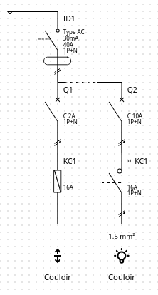

Le disjoncteur Q1 protège la bobine du télérupteur KC1. Le disjoncteur Q2 protège l'éclairage couloir, le télérupteur KC1 asservi le disjoncteur Q2.

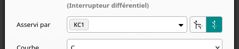

Vous remarquerez le choix du type d'asservissement. Dans notre exemple, le disjoncteur Q2 ne protège que le circuit 'Eclairage couloir', donc c'est un asservissement total.

Autre exemple. Nous souhaitons que le disjoncteur Q2 protège aussi le circuit d'éclairage Salon.

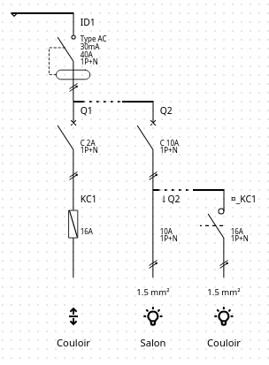

Pour ce faire, dans les propriétés du disjoncteur Q2, nous remplaçons le libellé 'Couloir' par 'Salon' puis dans les propriétés du schéma, nous indiquons un asservissement partiel.

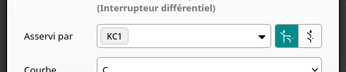

Et voila! La magie de Tiquettes.fr à encore opérée. :-)

<div id="allocation-dun-module-a-ses-enfants"></div>

#### Allocation d'un module a ses enfants

Dans certains cas il est utile de partager un module pour alimenter plusieurs enfants. Par exemple, vous voulez indiquer la présence d'un voyant dans votre tableau électrique:

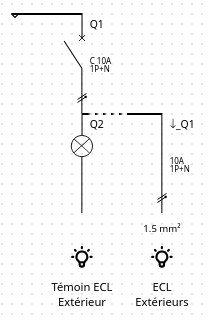

Sur le schéma ci-dessus, le disjoncteur Q1 alimente l'éclairage extérieur mais aussi le voyant modulaire, état de fonctionnement de cet éclairage.

Pour permettre ce montage, il faut indiquer à l'application de partager la source d'un circuit via cette fonction:

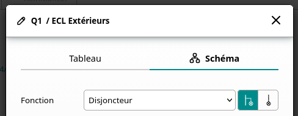

Une manière simple et rapide d'indiquer à l'application que vous souhaitez partager un module.

<div id="génération-du-schéma-unifilaire"></div>

#### Les liens de parenté

Un montage électrique possède bien souvent une hiérarchie. Cette notion peut se caractériser par des liens de parenté. Un disjonteur protégeant un circuit, va être un des enfants d'un interrupteur différentiel, qui lui, pourra être l'enfant d'un sectionneur générale, etc.

Cette hiérarchie se traduit par un sélecteur dans l'édition d'un module, onglet ```Schéma```:

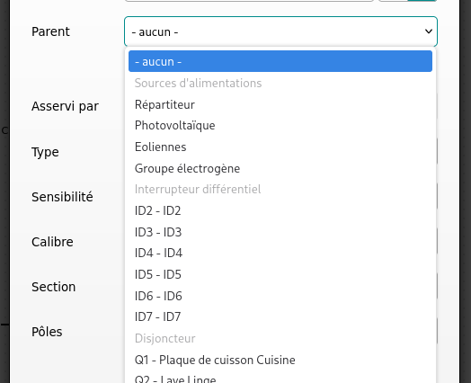

Une liste vous propose les différents modules présents dans votre tableau électrique, ainsi que [les sources d'alimentations définies](#les-sources-dalimentations).


### Génération du schéma unifilaire

La génération dépend à 100% des données que vous aurez renseignées lors de l'édition d'un module.

Le schéma généré en temps réel est accessible via l'onglet ```Schéma``` du tableau de bord :

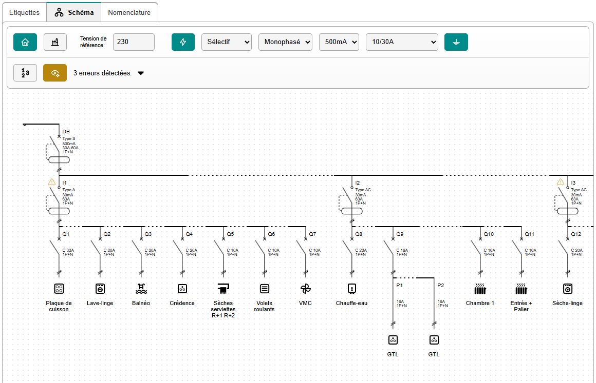

> <b>🛈 Bon à savoir</b>
>
> 
>
> A tout moment, vous pouvez ré-assigner l'ensemble des identifiants votre projet en cliquant sur ce bouton (accessible
> dans l'onglet ```Éditeur``` et ```Schéma```.


Pour éditer un module, il suffit juste de cliquer dessus ;-)

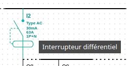

Au-dessus du schéma vous retrouverez l'espace ```barre à outils``` vous proposant dans cet onglet, différents réglages.

Pour commencer, vous avez la possibilité d'ajouter un ```Disjoncteur de branchement``` à votre schéma. Vous pouvez
l'activer ou le désactiver en utilisant cette
icône .
Différents réglages sont disponibles pour s'adapter au mieux à votre besoin.

S'ensuit la possibilité, via un clic sur cette
icône ,
d'ajouter un bornier / ligne de terre au schéma.

L'icône  permet d'activer
ou non le <a href="#moniteur-de-surveillance">Moniteur de surveillance</a>.

<div id="moniteur-de-surveillance"></div>

#### Les sources d'alimentations

L'application vous permet d'identifier la ou les sources alimentant les différentes sections de votre tableau électrique. Que ce soit un disjonteur de branchement, un répartiteur ou des panneaux photo-voltaïque, une option pour les définir est à votre disposition via ce bouton:

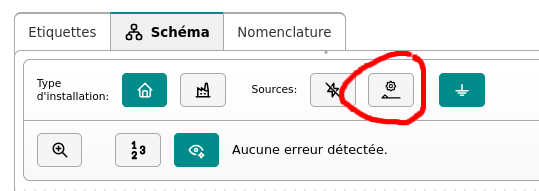

En cliquant sur ce bouton, vous pourrez ajouter et / ou supprimer autant de sources que vous le souhaitez:

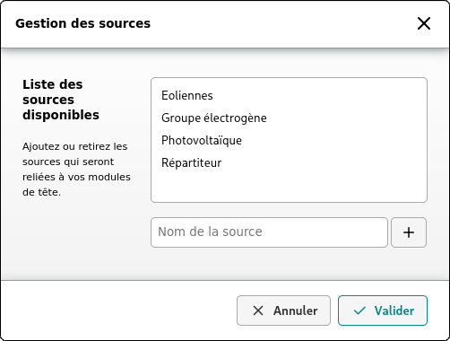


## Moniteur de surveillance

Certains onglets, se voient ajouté dans leur barre à outils, un bouton d'activation du moniteur de
surveillance .

Depuis la version 2.0.0 de l'application, Tiquettes vous propose une relative détection des erreurs dans votre projet.
Ces "erreurs", correspondent à des règles définies dans la norme NFC 15-100 à l'instant T. Vous pouvez bien évidement
désactiver cette surveillance à tout moment.

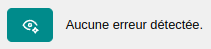 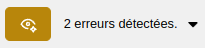

Le moniteur surveillera l'application des règles suivantes (NFC 15-100 09/2024) :

- **Étiquettes**: Le respect du minimum de 20% d'espace libre dans l'enveloppe du tableau.
- **Schéma**: Le nombre de circuits associés à un interrupteur différentiel : 8 (sauf pour le tertiaire).
- **Schéma**: Le nombre minimum d'interrupteurs différentiels : 2.
- **Schéma**: Le type de protection différentielle parente pour les circuits Plaque de cuisson, Chauffages et
  Bornes/Prises de recharge : Type A.
- **Schéma**: Le calibre de l'interrupteur sectionneur en fonction du calibre du disjoncteur de branchement (si ajouté
  au schéma).
- etc.

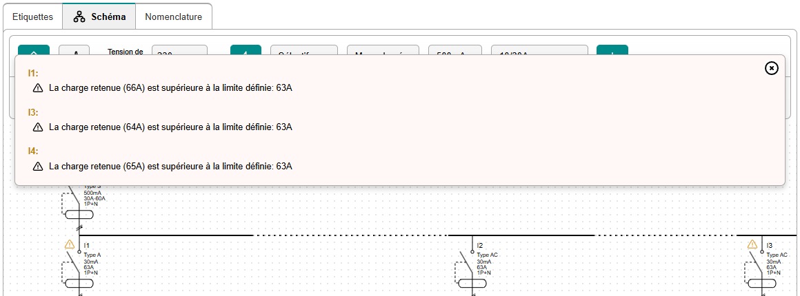

La surveillance, lors de la conception de votre projet, s'améliorera avec le temps et de nouvelles règles s'ajouteront
au fur et à mesure des prochaines versions!

<div id="nomenclature--résumé"></div>

## Nomenclature / Résumé

Tiquettes vous propose de résumer votre projet.

La nomenclature est générée automatiquement en fonction des définitions indiquées dans l'éditeur.

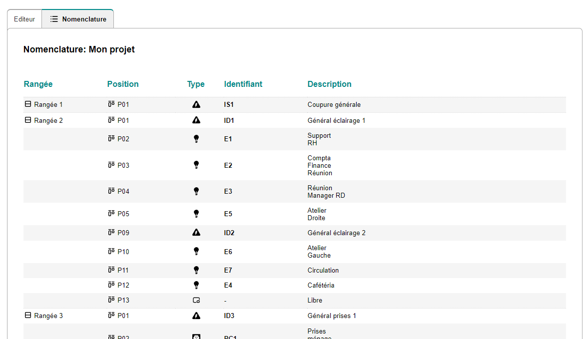

La barre à outils regroupe cette fois, la liste des colonnes que vous souhaitez afficher. Ce paramètre est
automatiquement associé à votre projet, ce qui signifie qu'il sera, lui aussi, exporté.


<div id="impression"></div>

## Impression

Il est temps de coucher votre oeuvre sur papier.

<div id="page-de-garde"></div>

### Page de garde

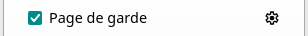

Tout dossier comporte une page de garde, décrivant le projet. Tiquettes vous propose d'imprimer cette page de garde et vous donne la possibilité de choisir les données à afficher

En cliquant sur l'icône engrenage vous accédez aux différentes propriétés:

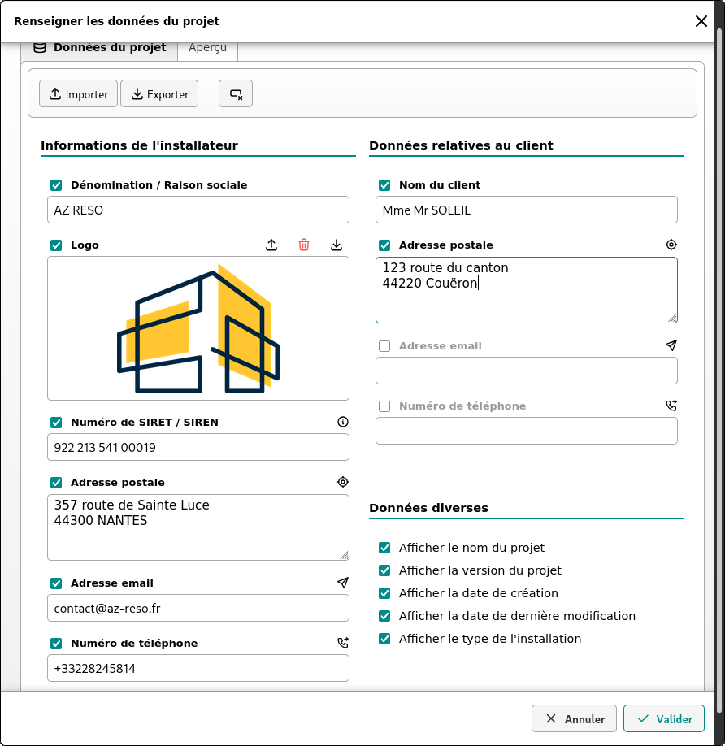

Exemple de rendu:

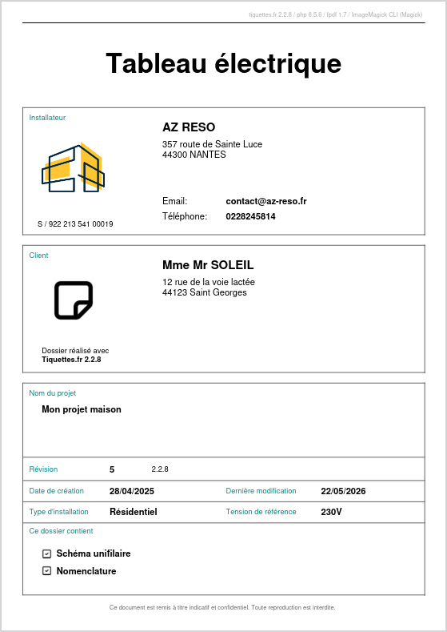

<div id="etiquettes"></div>

### Etiquettes

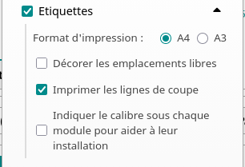

Le but principale de l'application est quand même d'imprimer ses étiquettes :-)

Alors cette partie du menu vous permets d'affiner les paramètres d'impression.


**Décorer les emplacements libres**: Permet d'appliquer le thème aux emplacements libres (cf image 1)

**Imprimer les lignes de coupe**: Inclut des traits de coupe pour les massicots (cf image 2)

**Indiquer le calibre sous chaque module**: Inscrit sous l'étiquette le calibre du module (cf image 3)
pour aider à leur installation


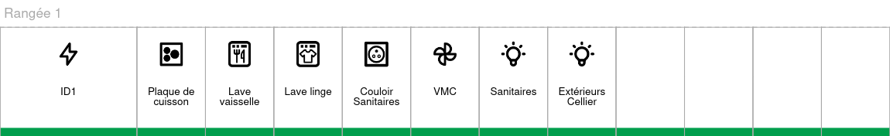
<small>*image 1*</small>

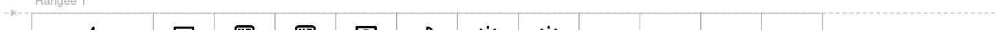
<small>*image 2*</small>

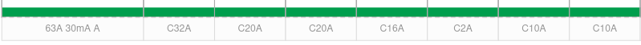
<small>*image 3*</small>

<div id="schéma-unifilaire"></div>

### Schéma unifilaire

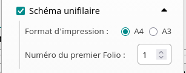

Tiquettes.fr vous propose la génération semi automatique du schéma unifilaire associé à votre tableau électrique. 

En cas de rénovation vous avez la possibilité de démarrer le Folio à la page de votre choix.


<div id="nomenclature"></div>

### Nomenclature

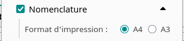


<div id="listedesmodules"></div>

### Liste des modules

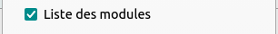

Imprime une page regroupant les modules par leurs caractéristiques globales ainsi que les quantités calculées. Celà peut être très pratique pour aider à préparer une liste de matériel à commander.


<div id="les-étiquetteuses"></div>

## Les étiqueteuses  (en cours de développement)

Depuis la version 2.2.8, l'application vous propose d'exporter vos planches d'étiquettes de manière compatible avec certains modèles d'étiqueteuses. Proposée dans le menu d'exportation, cette fonctionnalité vous demande dans un premier temps les rangées à exporter.

Cette sélection fonctionne comme le système de sélection des pages à imprimer:


**1-4**: Sélectionne les rangées de 1 à 4 incluses
**1,3,6**: Sélectionne les rangées 1, 3 et 6


Par ailleurs, vous pouvez assembler les sélections:


**1-3, 5-6, 8** : Sélectionne les rangées de 1 à 3 incluses, de 5 à 6 incluses, ainsi que la 8ème rangée


Votre choix fait, il ne vous reste plus qu'à cliquer sur l'icone de téléchargement pour configurer la mise en forme avant exportation.

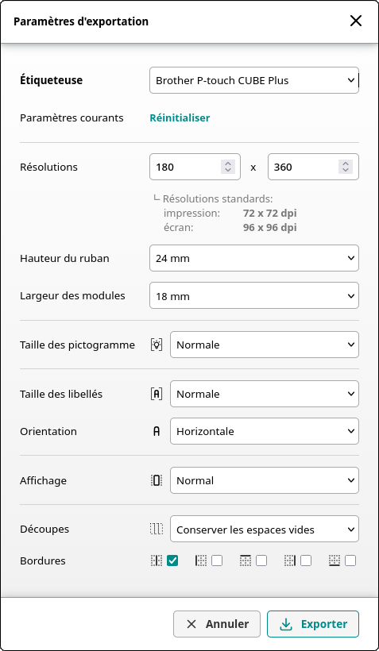

**Etiqueteuse**: Permet de choisir un modèle d'étiqueteuse préprogrammé. Chaque modèle mémorise les derniers paramètres modifiés.

**Résolutions**: Les appareils ont différentes résolutions. Pour mieux adapter la qualité des images produites à chaque appareil, veillez à correctement renseigner ces valeurs.

**Hauteur du ruban**: Largeur / Hauteur du ruban sur lequel sera imprimé les  rangées.

**Largeur des modules**: Largeur des modules du tableau électrique.

**Taille des pictogrammes**: Vous pouvez choisir de ne pas afficher les pictogrammes ou de choisir la taille qu'ils prendront sur l'étiquette.

**Taille des libellés**: Vous pouvez choisir de ne pas afficher les libellés ou de choisir la taille qu'ils prendront sur l'étiquette.

**Orientation**: Orientation verticale ou horizontale des libellés.

**Affichage**: La majorité des étiqueteuses permettent d'imprimer normalement ou d'inverser les couleurs. Noir sur fond blanc ou Blanc sur fond noir.

**Découpes**: Pour économiser les rubans vous pouvez choisir de supprimer tout en partie les espaces vides. Il vous faudra découper pour assembler.

**Bordures**: Pour vous repérer dans le découpage, vous pouvez choisir les bordures à imprimer.

Les paramètres sont simples et permettent une mise en forme rapide. Le résultat sera exporté sous forme d'un fichier ZIP contenant une image PNG monochrome par rangée.


### Fin!

---

<div class="remerciements--"></div>

# Remerciements ❤ !

Au travers vos utilisations de Tiquettes, vous n'hésitez pas à me remonter des bugs, proposer de nouvelles idées, et vous m'offrez un café donc je vous en remercie fortement pour tout celà !

### ☕ Dans un premier temps, gros merci pour tous vos soutiens financiers ;-)

Si vous souhaitez nous soutenir, c'est par ici: [Faire un don](https://www.tiquettes.fr/dons.php)

### 🐛 Mais aussi pour toutes les remontées de [BUGS](https://github.com/pantaflex44/Tiquettes/issues?q=is%3Aissue) (les [issues](https://github.com/pantaflex44/Tiquettes/issues?q=is%3Aissue)) , et vos participations dans les [discussions](https://github.com/pantaflex44/Tiquettes/discussions)

[zoliaaz](https://github.com/zoliaaz), [cnaslain](https://github.com/cnaslain), [ntarocco](https://github.com/ntarocco), [jlecour](https://github.com/jlecour), [plouflechien](https://github.com/plouflechien), [Benoit485](https://github.com/Benoit485), [F4FXL](https://github.com/F4FXL), [dough29](https://github.com/dough29), [karimLG](https://github.com/karimLG), [fmdl](https://github.com/fmdl), [ekozan](https://github.com/ekozan), [Starlight58](https://github.com/Starlight58), [Trinakria23](https://github.com/Trinakria23), [Boubigloubi](https://github.com/Boubigloubi), [martinlbb](https://github.com/martinlbb), [rems64](https://github.com/rems64), [Biodom13](https://github.com/Biodom13), [mmnlfrrr](https://github.com/mmnlfrrr), [LeG2](https://github.com/LeG2), [misterg94](https://github.com/misterg94), [Fanka14](https://github.com/Fanka14), [xhark](https://github.com/blogmotion), [yar0d](https://github.com/yar0d), [BenoitCier](https://github.com/BenoitCier), [gmergoux](https://github.com/gmergoux)

### Un remerciement spécial pour vos partages et les articles / messages promouvant Tiquettes.fr sur la toile

[Tiquettes.fr : faites vos tableaux électriques en OpenSource](https://www.minimachines.net/actu/tiquettes-tableaux-electrique-141182) (**[MiniMachines.net](https://www.minimachines.net)**)

[Logiciel gratuit pour imprimer les étiquettes de tableau](https://forum.gce-electronics.com/t/logiciel-gratuit-pour-imprimer-les-etiquettes-de-tableau/19416) (**[Forum GCE Electronics](https://forum.gce-electronics.com)**)


