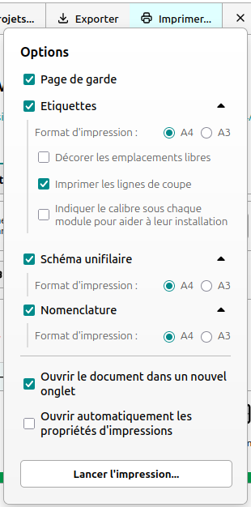

# Tiquettes

Générateur d'étiquettes pour tableaux / armoires électriques.

---

https://pantaflex44.github.io/Tiquettes/

<u>Licence</u>: MIT 
<u>Auteur</u>: Christophe LEMOINE <pantaflex (at) hotmail (dot) fr> 
<u>Création</u>: 26/05/2024 

---

## Le projet

Tout commence par l'initialisation de son projet.

Deux possibilités:

- Créer un nouveau projet
- Importer un projet sauvegarder

### Créer un nouveau projet par défaut

L'application définie automatiquement un tableau électrique de 4 rangées, 13 modules par rangée avec une hauteur des étiquettes de 30mm.

Bien évidement vous pouvez modifier ces valeurs en agissant sur les réglages proposés. Commencez par le réglage du nombre de modules, puis de rangées, et finissez avec la hauteur des étiquettes.

Le nouveau tableau s'ajustera automatiquement.

### Importer un projet sauvegardé

Tiquettes vous propose d'importer et d'exporter votre travail pour l'archiver ou y retravailler ultérieurement. Une sauvegarde automatique de votre session de travail est aussi intégrée au système.

Pour importer un projet, cliquez sur le bouton `Importer` puis chargez le fichier correspondant à votre projet. Immédiatement, celui-ci s'affichera dans la zone de travail!

### Résumé du projet

Une fois le projet chargé, vous retrouverez un résumé de ses propriétés au dessus de la zone de travail.

En premier, se regroupe le nom donné au projet ainsi que la version d'exportation. Cette version se met automatiquement à jour au moment de chaque exportation.

> <b>🛈 Bon à savoir</b>
>
> Pour modifier le nom du projet, cliquez dessus puis validez les modifications avec la touche `Entrée` de votre clavier. A contrario, la touche `Echap` annule les modifcations.
>
> 

Puis, vous retrouvez les dates de travail ainsi que le descriptif technique.

## L'éditeur

### Descriptif

Un tableau peut comporter de 1 à 15 rangées, 13, 18 ou 24 modules par rangée.

Chaque module peut avoir une largeur et/ou une position réglable en fonction de la place disponible autour de lui. Vous pourrez l'étendre jusqu'à rencontrer, soit le bout de la rangée, soit un autre module déja défini. Vous devrez libérer celui-ci pour pousuivre son expansion. Idem pour le déplacer, seulement possible dans les espaces libres.

### Menu contextuel du haut

Le symbole `+` vous permet d'agrandir le module d'une largeur sur sa droite.

Le symbole `-` vous permet de réduire le module d'une largeur.

Le symbole `←` vous permet de déplacer le module d'une position sur la gauche.

Le symbole `→` vous permet de déplacer le module d'une position sur la droite.

### Menu contextuel du bas

Le symbole `Crayon` (ou la touche `Entrée` du clavier) permet d'éditer le module en question.

#### Copier / Coller

Le symbole suivant permet de copier le module. Celà permet de copier, le libellé, le pictogramme et la description du module pour le duppliquer ailleurs sur le tableau. Une fois le module mis dans le presse papier, l'application vous met en avant les emplacements disponibles en fonction de la largeur initiale du module copié.

Exemple d'emplacements disponibles:

Cliquer sur le bouton pour duppliquer le module à cet emplacement:

Pour annuler, soit, cliquer sur l'icône ci-dessous, soit appuyer sur la touche `Echap`:

Et voilà!

### Manipuler les rangées

Au cours de l'édition de votre planche d'étiquette, il peut parfois être utile d'insérer et/ou de supprimer une rangée.

Pour insérer une rangée, cliquez sur le raccourci présent entre chacune des rangées éxistantes:

Pour supprimer une rangée, cliquez sur l'icone `Corbeille`, à gauche du nom de la rangée souhaitée:

#### Raccourcies claviers / souris

Lors de la définition de votre planche d'étiquettes, vous pouvez utiliser votre clavier pour interagir sur les rangées et les modules.

- Pour faire défiler les rangées verticalement, vous pouvez utiliser les flèches `haut` et `bas` de votre clavier, l'ascenseur de la fenètre ou la roulette de votre souris.
- Pour faire défiler les rangées horizontalement, vous pouvez utiliser l'ascenseur de la fenètre ou la roulette de votre souris (en appuyant simultanement sur une des touches `shift` de votre clavier).
- Pour déplacer un module horizontalement, sélectionnez le avec votre souris, puis appuyez sur les flèches `gauche` et `droite` de votre clavier.
- Pour redimensionner un module, sélectionnez le avec votre souris, puis appuyez sur les touches `+` et `-` de votre clavier.

## Edition d'un module

Après avoir cliqué sur le symbole d'édition d'un module, une fenêtre popup s'ouvre et vous offre la possibilité d'affiner sa définition.

La partie inférieure de la fenètre d'édition comporte une zone de démonstration, mettant en scène vos modifications en temps réel.

- _Identifiant_ : Identifiant technique du module. Seules les lettres, chiffres et le caractère point son acceptés.
- _Libellé_ : Une très courte description du module. Les retours à la ligne sont pris en compte.
- _Pictogramme_ : Une petite image illustrant l'environement du module.

### Les actions disponibles

- **Supprimer**: Permet de libérer un module. Supprime toutes les données liées à ce module.
- **Annuler**: Annule les modifications en cours
- **Valider**: Accepter et appliquer les modifications ne cours

### Les pictogrammes

Une liste de pictogrammes vous est proposée.

Par ailleurs, vous pouvez aussi rechercher un picto, directement en écrivant une partie de sa description. La liste se mettra automatiquement à jour.

## Décorer ses étiquettes

A chacun son style, à chaque coffret sa marque, quoi de mieux que de pouvoir décorer ses étiquettes au style de la marque du matériel installé?

Sélectionnez le thème de votre choix puis admirez le style de vos étiquettes changez en temps réel!

- Thème Simple

- Thème Minimal

- Thème Schneider - Standard

- Thème Schneider - Alternatif

- Thème Schneider - Nouveau format - Logements

- Thème Schneider - Nouveau format - Tertiaire

- Thème Hager - Ancien format - Logements

- Thème Hager - Ancien format - Tertiaire

- Thème Hager - Nouveau format - Logements

- Thème Hager - Nouveau format - Tertiaire

- Thème Legrand - Monochrome - Logements

- Thème Legrand - Monochrome - Tertiaire

- Thème Legrand - Couleur - Logements

- Thème Legrand - Couleur - Tertiaire

## Nomenclature / Résumé

Tiquettes vous propose de résumer votre projet.

La nomenclature est générée automatiquement en fonction des définitions indiquées dans l'éditeur.

## Immortaliser son travail

Une fois vos étiquettes réalisées, vous pourrez les imprimer en cliquant sur le bouton adéquat.

Sélectionnez le mode `paysage` pour simplifier la mise en page.

> <b>🛈 Bon à savoir</b>
>
> Choisissez d'imprimer le fond et les images pour avoir un rendu tel votre écran.
>
> Imprimez toujours en taille réelle sans ajustement de la page. Surtout valable si vous souhaitez imprimer un projet préalablement enregistré en PDF. Acrobat Reader, notamment, ajuste par défaut le document au format papier sélectionné.

## Fin!
